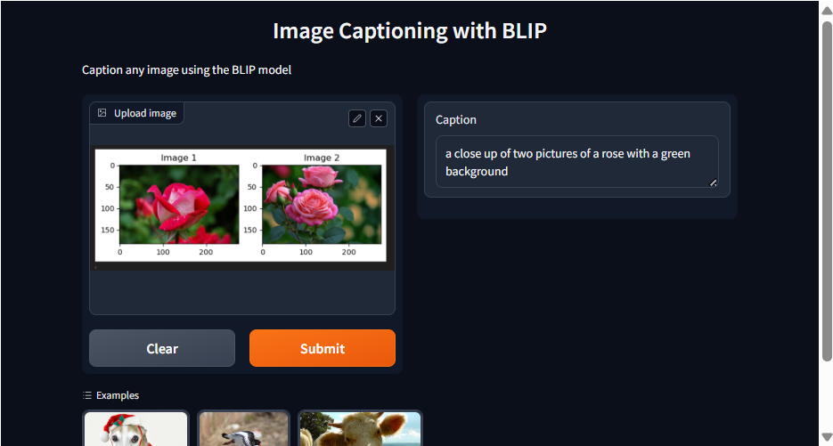
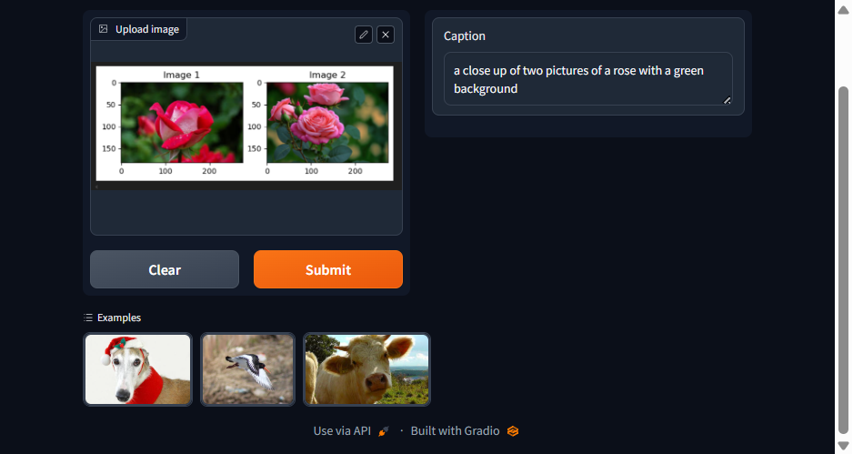

## Prototype Development for Image Captioning Using the BLIP Model and Gradio Framework

### AIM:
To design and deploy a prototype application for image captioning by utilizing the BLIP image-captioning model and integrating it with the Gradio UI framework for user interaction and evaluation.

### PROBLEM STATEMENT:
To design and deploy a prototype application for image captioning by utilizing the BLIP image-captioning model.

### DESIGN STEPS:

#### STEP 1:
Configure environment variables, load the Hugging Face API key, and set up the get_completion function to interact with the image-to-text (BLIP) model endpoint.

#### STEP 2:
Define functions to convert uploaded images to base64 strings and retrieve captions from the API using the BLIP model.

#### STEP 3:
Build an interactive Gradio interface for users to upload images and receive captions, with optional examples and shareable link.

### PROGRAM:
```
import os
import io
import IPython.display
from PIL import Image
import base64 
from dotenv import load_dotenv, find_dotenv
_ = load_dotenv(find_dotenv()) # read local .env file
hf_api_key = os.environ['HF_API_KEY']

# Helper functions
import requests, json

#Image-to-text endpoint
def get_completion(inputs, parameters=None, ENDPOINT_URL=os.environ['HF_API_ITT_BASE']):
    headers = {
      "Authorization": f"Bearer {hf_api_key}",
      "Content-Type": "application/json"
    }
    data = { "inputs": inputs }
    if parameters is not None:
        data.update({"parameters": parameters})
    response = requests.request("POST",
                                ENDPOINT_URL,
                                headers=headers,
                                data=json.dumps(data))
    return json.loads(response.content.decode("utf-8"))

image_url = "https://free-images.com/sm/9596/dog_animal_greyhound_983023.jpg"
display(IPython.display.Image(url=image_url))
get_completion(image_url)

import gradio as gr 

def image_to_base64_str(pil_image):
    byte_arr = io.BytesIO()
    pil_image.save(byte_arr, format='PNG')
    byte_arr = byte_arr.getvalue()
    return str(base64.b64encode(byte_arr).decode('utf-8'))

def captioner(image):
    base64_image = image_to_base64_str(image)
    result = get_completion(base64_image)
    return result[0]['generated_text']

gr.close_all()
demo = gr.Interface(fn=captioner,
                    inputs=[gr.Image(label="Upload image", type="pil")],
                    outputs=[gr.Textbox(label="Caption")],
                    title="Image Captioning with BLIP",
                    description="Caption any image using the BLIP model",
                    allow_flagging="never",
                    examples=["christmas_dog.jpeg", "bird_flight.jpeg", "cow.jpeg"])

demo.launch(share=True, server_port=int(os.environ['PORT1']))

gr.close_all()
```

### OUTPUT:



### RESULT:
Thus, The designing and deploying of a prototype application for image captioning by utilizing the BLIP image-captioning model is executed successfully.